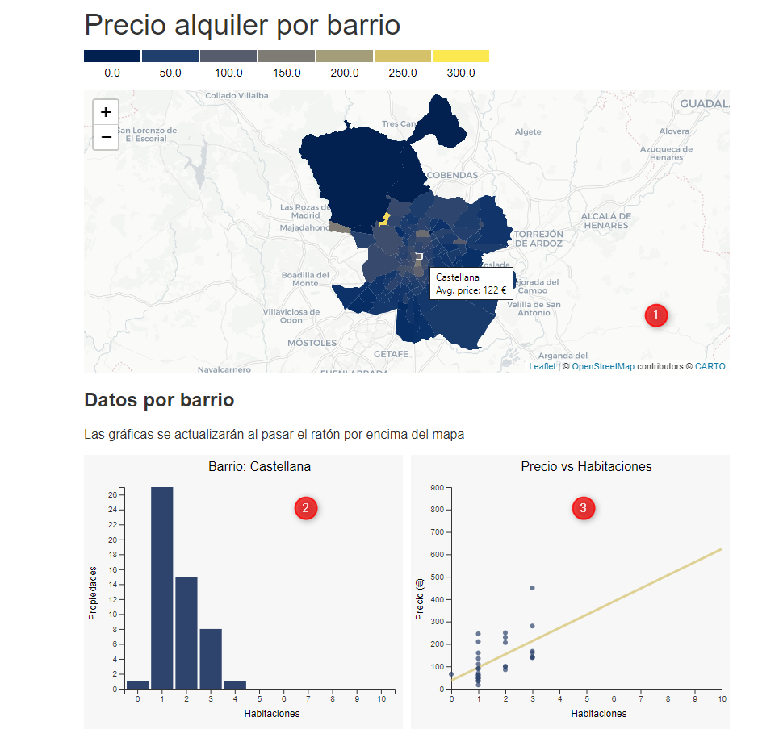

# Exploración y Visualización de Datos con D3.js
Práctica de Exploración y Visualización de Datos con D3 del _Bootcamp Big Data & Machine Learning_ de [KeepCoding](https://keepcoding.io/es/).

## Objetivo
Esta práctica tiene como ojetivo desarrollar un pequeño dashboard mediante el uso de librería **D3.js**. El dahsboard se compone de tres gráficas que representarán:
1. Un mapa con los barrios de Madrid, donde los colores indiquen el precio medio de alquiler por barrio.
1. Una gráfica para visualizar cuántas propiedades hay en función del número de habitaciones.
1. Una gráfica donde se muestre el precio del alquiler frente al número de habitaciones, además de una recta que respresente la regresión lineal calculada a partir de estos puntos.

Las dos gráficas mostrarán la información relativa al barrio seleccionado en el mapa superior.

### Dataset
El dataset utilizado es un fichero json adaptado para la práctica, con información geogragráfica de los barrios en formato geojson y la información necesaria para el resto de gráficas.

## Desarrollo
La página web desarrada consta de varios ficheros:
- index.html: página principal, con la estructura para cargar los gráficos
- main.css: hoja de estilos para definir la estructura de la página y colores de los gráficos.
- map-d3-leaflet.js: son las funciones de javascript programadas para leer los datos, y repesentarlos haciendo uso de la librería _d3.js_.  

A continuación se muestra una captura donde se pueden visualizar los tres gráficos del dashboard desarrollado.



- La visualización del mapa de _d3.js_ se ha integrado con la librería _Leaflet_, con el ojetivo de poder visualizar un mapa base junto con el de barrios de Mardrid (en nuestro caso un mapa proporcionado por CartoDB)
- Las gráficas 2 y 3 se actualizan con la información relativa a un barrio. La selección de un barrio se realiza al pasar el puntero por encima de uno de los barrios del mapa.
- El eje Y (del gráfico 2) es dinámico para permitir visualizar mejor los valores, sin embargo, en el caso de la gráfica de la Regresion Lineal se ha mantenido estático para que se puedan comparar mejor las rampas de la RL entre distintos barrios.

## Estudio y dudas
A la hora de integrar _Leaflet_ con _d3.js v5_ he tenido muchos problemas para poder detectar los eventos del ratón desde la capa de _d3.js_. Parece ser que con las últimas versiones de _Leaflet_ se deshabilita la interacción con las capas mediante css
```css
.leaflet-pane > svg path {
  pointer-events: none;
}
```
Para resolver este problema he tenido que sobrescribir esta propiedad en mi hoja de estilos.
```css
.region{
    pointer-events: visible !important;
}
```
No sé si hay otra forma mas correcta de resolver este inconveniente entre _d3.js_ y _Leaflet_.

Por otro lado, para facilitar la lectura de los datos, quería mostrar cierta información mediante tooltips. En la libreria d3.js parece que no hay ninguna funcionalidad especifica para ello, pero encontré algunas librerías desarrolladas por terceros (https://github.com/cgav/d3-tip). He intentado utilizar esta libreria pero no he conseguido cargar el js desde la página de inicio, como se muestra en algunos ejemplos de uso de la version para _d3.js v3_.

## Referencias  
Alguna de las páginas consultadas para el desarrollo de la práctica han sido:
- Repositorio D3.js (https://github.com/d3)  
- Galerias de ejemplos (https://d3js.org/ y https://www.d3-graph-gallery.com/index.html)  
- Libreria para Regresion Lineal (https://github.com/simple-statistics/simple-statistics)  
- Leyendas D3.js (https://d3-legend.susielu.com y https://observablehq.com/@d3/color-legend)  
- Tooltips D3.js (https://github.com/cgav/d3-tip)

